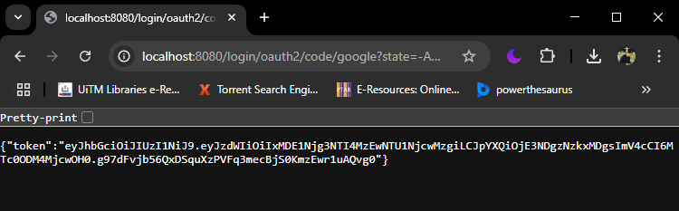

# 📍 UK Postcode Distance Microservice

A simple RESTful microservice that calculates the geographic distance between two UK postcodes.

## Features

- Unit & Integration Testing  
- OAuth 2.0 Authentication (Google)  
- Docker Containerization  

---

## Tech Stack

| Component     | Version                        |
|---------------|--------------------------------|
| Java          | 17.0.10                        |
| Spring Boot   | 3.5.0                          |
| MySQL         | 15.1 (MariaDB 10.4.28)          |
| Tools         | XAMPP, DBeaver, Postman, Docker |

---

## Sample Payload

```json
{
  "postcode1": "AB16 6SZ",
  "postcode2": "EC1A 1BB"
}
```

## Sample Response

```json
{
    "location1": {
        "postcode": "AB16 6SZ",
        "latitude": 57.158751,
        "longitude": -2.165215
    },
    "location2": {
        "postcode": "EC1A 1BB",
        "latitude": 51.524502,
        "longitude": -0.112088
    },
    "distance": 640.3716294161608,
    "unit": "km"
}
```

## Call Endpoint Using Postman


---

## Setup Instructions

### Database Setup

I am using **XAMPP** for MySQL and **DBeaver** to import CSV data taken from 
[FreeMapTools - UK Postcode Latitude Longitude](https://www.freemaptools.com/download-uk-postcode-lat-lng.htm)

#### SQL Script

```sql
-- create database
CREATE DATABASE IF NOT EXISTS dhl_hafizin_db
CHARACTER SET utf8
COLLATE utf8_general_ci;

-- create table
CREATE TABLE dhl_hafizin_db.uk_postcodes (
  id INT AUTO_INCREMENT PRIMARY KEY,
  postcode VARCHAR(10),
  latitude VARCHAR(20),
  longitude VARCHAR(20)
) ENGINE=InnoDB DEFAULT CHARSET=utf8 COLLATE=utf8_general_ci;

-- indexing
CREATE INDEX uk_postcodes_postcode_IDX USING BTREE ON dhl_hafizin_db.uk_postcodes (postcode);
CREATE INDEX uk_postcodes_latitude_longitude_IDX USING BTREE ON dhl_hafizin_db.uk_postcodes (latitude, longitude);
```

After run the queries, proceed to import data (for me I am using DBeaver to import data in CSV)


---

### Running the App

1. Clone this repository and navigate to the project directory.
2. Rename `.env.example` to `.env`.
3. Open `docker-compose.yaml` and fill in the following environment variables:
   - `SPRING_DATASOURCE_USERNAME` 
   - `SPRING_DATASOURCE_PASSWORD`
   - `GOOGLE_CLIENT_ID`
   - `GOOGLE_CLIENT_SECRET`

   *(To get `GOOGLE_CLIENT_ID` and `GOOGLE_CLIENT_SECRET` please refer to [Google Cloud OAuth Docs](https://developers.google.com/identity/protocols/oauth2)*
   
   *Ensure Authorized redirect URIs=http://localhost:8080/login/oauth2/code/google*

5. Build and run the app using Docker:

```bash
docker-compose up --build
```

Once successful, verify containers are running via Docker Desktop or CLI.

---

## Authentication via Google OAuth 2.0

To access the API, you need a Bearer token:

1. Visit [http://localhost:8080/oauth2/authorization/google](http://localhost:8080/oauth2/authorization/google)
2. Sign in with your Google account.
3. You will be redirected and shown a token like:

```json
{
  "token": "eyJhbGciOiJIUzI1NiJ9..."
}
```



---

## Testing the API in Postman

1. Create a **POST** request to:

```
http://localhost:8080/api/v1/distance
```

2. Set Authorization type to **Bearer Token** and paste your token.

3. Set Body to **raw > JSON** and enter:

```json
{
  "postcode1": "AB16 6SZ",
  "postcode2": "EC1A 1BB"
}
```

4. Hit **Send** to get the response.

---

## Unauthorized Error Example

If you call the API without authorization, you will receive:

```json
{
  "error": "Unauthorized",
  "status": 401
}
```

#### Unauthorized Error Screenshot


---
